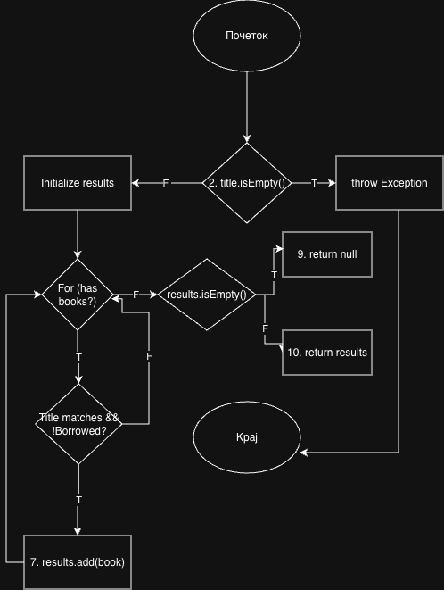

# SI_2026_lab2_233292
Rozeta Rozin Sopkova 233292

---

### 2. Control Flow Graph

---

### 3. Цикломатска комплексност
Цикломатската комплексност на функциите ја пресметав со помош на формулата $V(G) = P + 1$, каде $P$ е бројот на предикатни јазли (одлуки).

* **searchBookByTitle**: Комплексноста е **3** (има 2 `if` одлуки).
* **borrowBook**: Комплексноста е **4** (има 3 `if` одлуки).

---

### 5. Every Statement (searchBookByTitle)
За исполнување на овој критериум се потребни **2 тест случаи**:
1. **Empty Title**: Фрла `IllegalArgumentException`.
2. **Existing Book**: Ги поминува сите линии во `for` циклусот и враќа листа.

---

### 7. Every Branch (borrowBook)
За исполнување на сите гранки се потребни **3 тест случаи**:
1. **Invalid Input**: `title` или `author` се празни (True гранка на првиот `if`).
2. **Book Not Found**: Книгата не е пронајдена (True гранка на вториот `if`).
3. **Already Borrowed**: Книгата е веќе изнајмена (True гранка на третиот `if`).

---

### 9. Multiple Condition
**Услов 1: `if (title.isEmpty() || author.isEmpty())`**
* `T || X` (Празен наслов)
* `F || T` (Има наслов, празен автор)
* `F || F` (Има и наслов и автор)

**Услов 2: `if (book.getTitle().equalsIgnoreCase(title) && !book.isBorrowed())`**
* `F && X` (Насловот не се совпаѓа)
* `T && F` (Насловот се совпаѓа, но е изнајмена)
* `T && T` (Насловот се совпаѓа и не е изнајмена)
